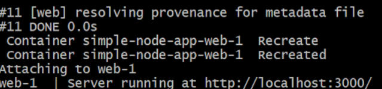
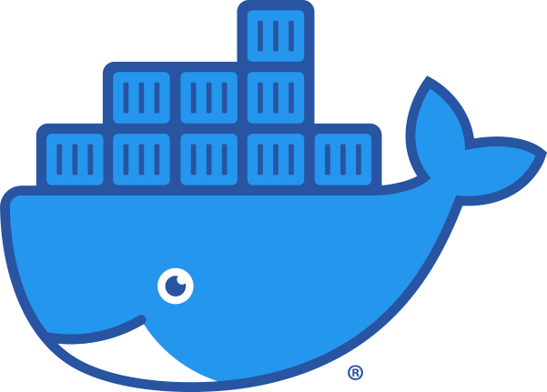
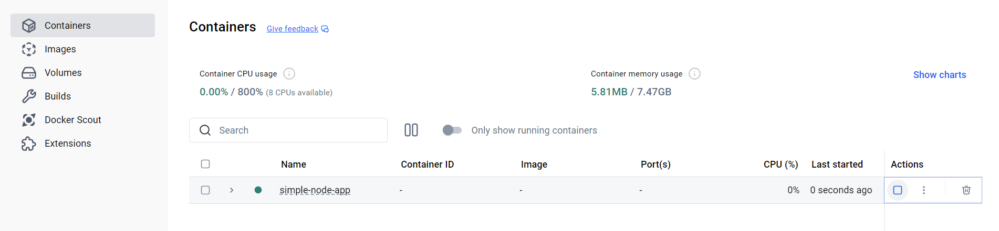
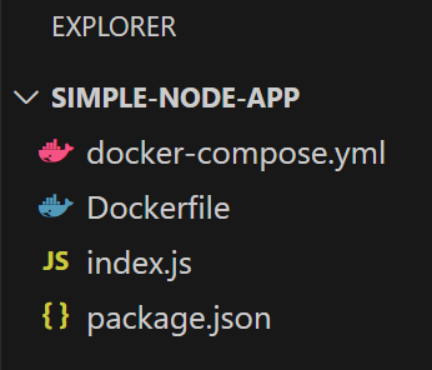

# How to Set Up and Use Docker for Web Development Projects

## Table of Contents
1. [Overview](#overview)
2. [Step-by-Step Instructions](#step-by-step-instructions)
3. [Learning Outcomes](#learning-outcomes)
4. [Potential Issues](#potential-issues)
5. [What to do Next? (Making a to-do list project)](#what-to-do-next-making-a-to-do-list-project)
6. [Resources](#resources)

## Overview


*Docker and Containerized Applications vs Virtualization Architectures*

Docker is a software development tool that allows developers to build, run, and deploy applications and web servers quickly through packages. These packages contain everything needed for these processes including libraries, system tools, code, and any other dependencies in containerized applications. Docker is similar to Virtualization in the sense that they both are used to deploy applications, but how they do so differs slightly.

With Virtualization, applications are run on virtual machines that each have their independent operating system and applications, all on a greater host computer and operating system. In other words, Virtualization containerizes on the operating system layer, allowing one computer to have multiple internal operating systems installed. Docker, however, containerizes on the application level, allowing applications to be run independently of the greater operating system. Docker has to be configured for the host operating system, but once it is, applications can be run on that computer, essentially virtually. 

Both have their advantages, but for Web Development projects, Docker is typically the way to go. It’s more portable and scalable than VMs because it removes the worry of any differences in development vs deployment architecture (developing on Linux but deploying on Windows for example). Docker containers are also much smaller than isolated VMs because those VMs require their operating systems. All of these factors contribute to a (typically) faster deployment cycle with easier sharing capabilities.

These instructions will detail how to make and run a simple web application using Docker.

## Step-by-Step Instructions
*A step-by-step guide to setting up Docker for a simple Node.js web application. This setup will create a lightweight environment to host a basic web server.*
<details>
    <summary>What is Node.js? </summary>
         Node.js is a JavaScript runtime environment that lets you execute JavaScript code outside of a web browser, typically on a server. This is beneficial as you can now use the popular JavaScript language, invented for the frontend, in your backend as well, improving readbility, sacalability, and simplifying your application logic. Node.js is designed for building fast, scalable network applications. 
</details>

### 1. Install Docker
Download Docker Desktop, go to the Docker [website](http://docs.docker.com/get-started/get-docker/) and download Docker Desktop for your OS (Windows, Mac, or Linux).
    
Install Docker, and follow the installation instructions for your system. Note that, installing Docker Desktop requires administrator privileges. However, once installed, it can be used without administrative access. Now open Docker Desktop to ensure it’s running.
<details>
    <summary>Find out your system architecture, which Docker Desktop to install </summary>
    Upon navigating to the Get Docker page and choosing your operating system, you may find multiple variations of Docker Desktop to install. These are for
    different system architectures. To find out yours, open a command terminal and enter accordingly based on your operating system

    Windows
    echo %PROCESSOR_ARCHITECTURE%

    Mac/Linux
    uname -m

    x86_64 systems will get the result AMD64.
    
</details>

If Docker is already installed on your operating system, and your administrator account is different to your user account, you must add the user to the docker-users group.
<details>
    <summary>Click Drop-Down Arrow for How To Add Users to a Group</summary>
    
    1. Open Command Prompt as Administrator
    Search “cmd”, right-click → Run as administrator

    2. Run this command : net localgroup docker-users your_username /add
    Replace your_username with your actual Windows username.
    
</details>

### 2. Navigate to Project Directory
Create a directory for your project and navigate into it using a command line interface (CLI) of your choice.
```bash
mkdir simple-node-app
cd simple-node-app
```

### 3. Configure your Node.js Project
In a code editor of your choice, create a new file and save it as ```package.json``` within the ```simple-node-app``` directory
```json
{
  "name": "simple-node-app",
  "version": "1.0.0",
  "main": "index.js",
  "scripts": {
    "start": "node index.js"
  }
}
```

To keep the spirit of Docker (dependency-free host setup), no local dependency installations are required, and all necessary dependencies are installed and run within the Docker container.


### 4. Create a Basic Web Server
Inside the project directory, create an index.js file with a simple Node.js (JavaScript) web server, you can do this using the code editor of your choice: 
```js
// index.js

// Include the Node.js http module
const http = require('http');

// Create a server object (req is the HTTP request, res is the response)
const server = http.createServer((req, res) => {
  res.statusCode = 200; // Return HTTP status code 200/OK
  // Show "Hello, Dockerized World!" on the webpage in plain text
  res.setHeader('Content-Type', 'text/plain');
  res.end('Hello, Dockerized World!\n');
});

// Run the server on port 3000
const port = 3000;
server.listen(port, () => {
  console.log(`Server running at http://localhost:${port}/`);
});
```

### 5. Create a `Dockerfile`
In the root of your project directory, create a file called `Dockerfile` that describes the environment and steps for running the Node.js app.
```docker
# Use an official Node.js runtime as the base image
FROM node:14

# Set the working directory in the container
WORKDIR /app

# Copy package.json and package-lock.json to install dependencies
COPY package*.json ./

# Install dependencies
RUN npm install

# Copy the rest of the application files
COPY . .

# Expose the app port
EXPOSE 3000

# Run the application
CMD ["node", "index.js"]
```
### 6. Add a `docker-compose.yml` for Easier Setup
To simplify running the app and for live reloading, create a `docker-compose.yml` file: 

```yml
version: '3'
services:
  web:
    build: .
    ports:
      - "3000:3000"
    volumes:
      - .:/app  # Mount current directory for live code updating
    environment:
      - NODE_ENV=development
```

### 7. Build and Run the Docker Container
In the terminal, run the following command to build and run the app:
```bash
docker compose up --build
```
This will build your Docker image based on the Dockerfile, start a container, and map your local port 3000 to the container’s port 3000.




### 8. Access the Application
Open your browser and go to http://localhost:3000 to see the script served from your Dockerized Node.js application.

### 9. Stop the Application
To stop the container, press Ctrl + C in the terminal, or run:
```bash
docker-compose down
```

### All done!


With this setup, you have a basic Dockerized Node.js application. Using Docker Compose helps keep your development environment isolated and allows you to add other services easily. 

## Learning Outcomes
- Familiarity with fundamental Docker concepts, including images, containers, and Dockerfiles. Building and running a Docker image, you’ll see how Docker packages your application with its dependencies, ensuring consistency across - different environments.
- Creating and Managing Dockerfiles
- Running and Testing Dockerized Applications
- Configuring Isolated Development Environments
- Container Management, Scaling, and Portability Skills

## Potential Issues
If something goes wrong in the setup process, the problem may only become apparent when trying to access the application at http://localhost:3000, where the site might fail to load.

The first sanity check should be to make sure the application is running. If building in a terminal, the terminal should display a “Server running” message as shown in Step 7. This can also be verified in the Containers tab of Docker Dashboard. If the desired container you want running has a triangle symbol under "Actions", the application is not running. Click the triangle to start the container, once it's running, the icon should change to a square.



If the application still doesn’t load, confirm that the project directory structure is correct:



All files must be in their proper locations with correct names, the picture above shows the project tree, all files on the same level. Since the code and commands in each of the files all reference each other, if a filename is changed, the references to the file must also be changed. For instance, the package.json file references `index.js` as its main file, and the Dockerfile lists `index.js` in the run command, but if this file was named `index.txt`, it could cause issues.

If the file structure is correct, verify the contents of each file. Compare your files to those shown in Steps 3–6. After confirming the above, repeat step 7.

## What to do Next? (Making a to-do list project)
The purpose of these instructions is to walk you through the basics of how Docker and its required elements (packages, containers, images) can be used to develop Web applications through a typical Hello World example project. This project only prints to a barebones site, but learning the process to get there is the end goal.

Another common software development project is a to-do list. Docker has a guide for how to make such an application with more in-depth development tasks like sharing the app, persisting a database, and multi-container apps. To access their guide for a to-do list manager application enter the command into your terminal:

```bash
docker run -dp 80:80 docker/getting-started
```

and open the browser to http://localhost

## Resources
https://docs.docker.com/get-started/get-docker/
